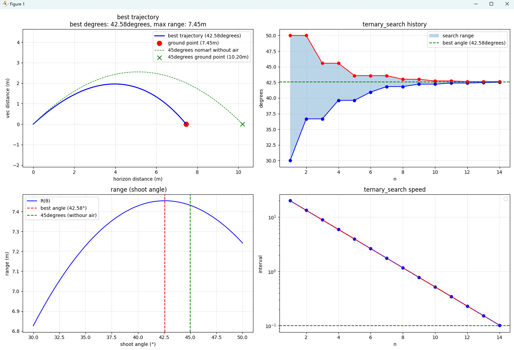

# AirDrag-RK4-Search

## 项目概述 (Project Overview)

本项目结合**四阶龙格-库塔法 (RK4)** 和**三分法 (Ternary Search)**，精确计算了在**二次方空气阻力**作用下，抛体能够达到**最远水平射程**时的**最优发射角度**。

在理想无阻力条件下，最优角度是 $45^\circ$。但在实际物理世界中，空气阻力（阻力正比于速度的平方 $F_{\text{drag}} \propto v^2$）的存在使得最优发射角度会**低于 $45^\circ$**。本项目旨在通过数值模拟和优化算法，高效地找到这个实际的最优角度。

---

## 方法与技术 (Methodology and Techniques)

### 1. 模拟核心：四阶龙格-库塔法 (RK4)

由于空气阻力项使得微分方程组非线性且无法解析求解，我们采用 RK4 法对抛体运动方程进行高精度数值积分。

**运动微分方程 (Acceleration):**

$$\vec{a} = \frac{d\vec{v}}{dt} = \vec{g} - k|\vec{v}|\vec{v}$$

其中 $\vec{g}$ 是重力加速度，$-k|\vec{v}|\vec{v}$ 是与速度方向相反的二次方空气阻力引起的加速度。RK4 法被用于求解 $(x, y, v_x, v_y)$ 在每个时间步长 $\Delta t$ 上的精确变化。

### 2. 优化算法：三分法 (Ternary Search)

水平射程 $R(\theta)$ 是一个单峰函数（Unimodal Function）：在 $[0^\circ, 90^\circ]$ 范围内，射程随着角度先增大后减小。

* **目标函数：** $R(\theta) = \text{calculate\_range}(\theta)$
* **优化目标：** $\max_{\theta} R(\theta)$
* **方法：** 三分法通过在搜索区间 $[L, R]$ 内计算两个内点 $m_1$ 和 $m_2$ 的函数值，排除包含较小函数值的一侧区间，从而快速收敛到最大值点。

---

## 代码结构与功能

本项目包含以下主要函数：

| 函数名称 | 核心功能 |
| :--- | :--- |
| `calculate_range(angle_deg, ...)` | 使用 **RK4 算法**模拟给定角度下的完整抛体轨迹，并返回水平射程。 |
| `ternary_search_optimization(...)` | 使用**三分法**在角度范围内迭代搜索，找到最大射程对应的最优角度。 |
| `plot_results(...)` | 绘制最优轨迹、射程-角度曲线以及三分法的收敛过程。 |
| `plot_parameter_analysis(...)` | 分析最优角度随初始速度 $v_0$ 和阻力系数 $k$ 的变化趋势。 |

---

## 使用说明 (Usage)

### 环境要求

* Python 3.x
* NumPy
* Matplotlib

### 运行程序

直接运行主程序即可启动优化过程并生成可视化图表：

```bash
python3 AirDrag-RK4-Search.py
```

### 运行效果

